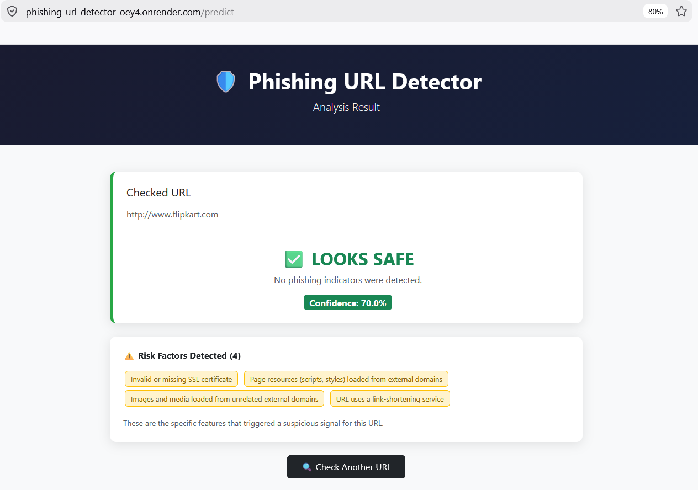

# Phishing URL Detector

A web app that checks if a URL looks like a phishing site or a safe one, and explains why. Built with Python, scikit-learn, and Flask, deployed live on Render.



Live demo: https://phishing-url-detector-oey4.onrender.com (Free tier, so it sleeps when unused. First load can take 30-60 seconds to wake up, it's not broken.)

## Why I built this

I'm a 12th grader interested in CS and cybersecurity. Most beginner ML projects I saw were just a notebook that prints an accuracy score and stops there. I wanted to build something you could actually use: type in a real URL and get a real answer, not just a number in a Jupyter notebook.

## What it does

* You type in a URL
* The app checks 22 things about it: valid SSL certificate, where the page's links actually go, whether the domain uses tricks like an IP address instead of a real name, and more
* A Random Forest model (trained on 11,000+ real websites) predicts safe or phishing
* You get a confidence percentage and the exact red flags that triggered, not just a yes/no

## Tech stack

Python, Flask, scikit-learn (Random Forest), pandas, requests + BeautifulSoup (fetching/parsing pages), ssl/socket (certificate and DNS checks), Bootstrap 5, deployed on Render with gunicorn.

## The model

Trained on the UCI Phishing Websites dataset (11,055 real websites). Tried Logistic Regression (92.4%) and Random Forest (96.7%); went with Random Forest since it also had fewer false negatives, which matters more than raw accuracy here.

The dataset's original 30 features included some that depended on services that don't exist anymore (like the old Google PageRank API), so a model trained on all 30 couldn't actually run on a real URL today. I figured out which 22 I could compute live, dropped the rest, and retrained. Accuracy dropped a little (96.7% to 95.3%) but now it actually works on real websites, which was the whole point.

Final model: 95.3% overall accuracy, and it catches 93 out of 100 actual phishing sites. That catch rate matters more than raw accuracy here, since missing a real phishing site is worse than a false alarm. The two biggest factors in the model's decisions are SSL certificate validity (32.6%) and where the page's links point (24.6%), together over half of what it bases its call on.

## Known limitation

When a page completely fails to load (dead domain), some checks default to "looks fine" just because there's no evidence of anything bad, but no evidence isn't the same as confirmed safe. So a dead or broken URL can end up with a weirdly low-confidence "safe" result instead of being flagged harder. Found this during testing and I'm documenting it honestly rather than rushing a fix before I fully understand it.

## Running it locally

```bash
git clone https://github.com/hemashribellary/phishing-url-detector
cd phishing-url-detector
python -m venv venv
source venv/bin/activate  # on Windows: venv\Scripts\activate
pip install -r requirements.txt
python build.py  # trains and saves the model
python app.py
```

Then open http://localhost:5000 in your browser.

## A note on debugging

The site would sometimes hang forever checking certain URLs. I spent a while assuming it was a server timeout and fixed some backend stuff (still worth fixing), but the real bug was a one-line JavaScript issue: disabling the submit button too early was silently cancelling the form in Firefox, so the request never reached my server. Found it by checking server logs (nothing showing up) then the browser's network tab (confirmed the request never sent). Lesson: check both ends, not just the one you assume is broken.

Built by a 12th grader still learning. Feedback welcome.
