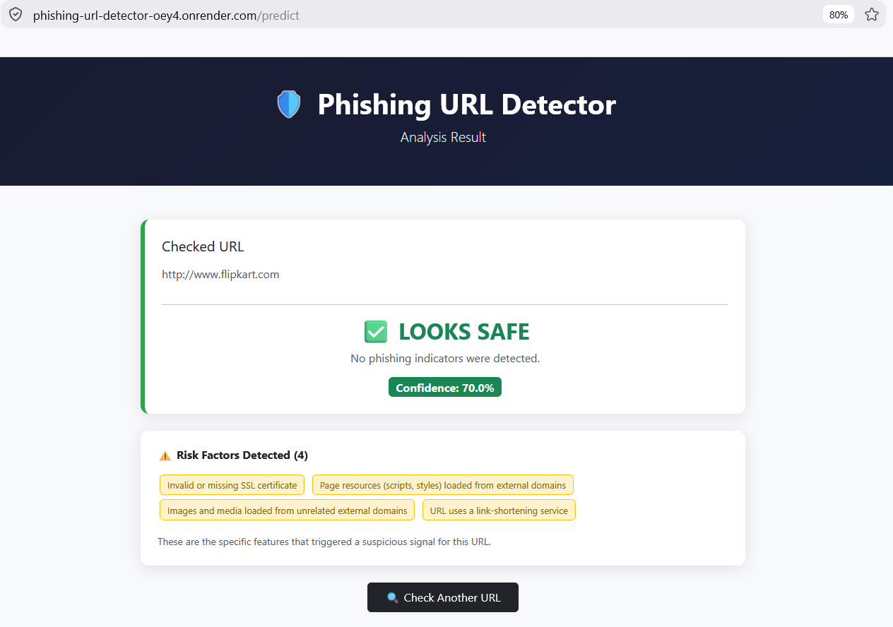

# Phishing URL Detector

A web app that checks if a URL looks like a phishing site or a safe one, and shows the red flags it found. Built with Python, scikit-learn, and Flask, deployed live on Render.

**Live demo:** https://phishing-url-detector-oey4.onrender.com
(Free Render tier, so it sleeps when unused and the first load takes 30-60 seconds.)

**Why I built this:** I wanted something you could actually use, not just a notebook that prints an accuracy score.

## What it does

* Checks 22 features of a URL: SSL certificate, where links point, IP-address tricks, and more
* Returns a confidence % and the exact red flags triggered, not just yes/no

## Tech stack

Python, Flask, scikit-learn, pandas, BeautifulSoup, Bootstrap 5, gunicorn. Deployed on Render.

## The model

Random Forest trained on the UCI Phishing Websites dataset (11,055 labeled sites). On the held-out test set it reaches 95.3% accuracy and catches 889 of 956 phishing sites (93%), missing 67.

The dataset has 30 features, but 8 of them depended on services I couldn't use anymore (like Google PageRank). I dropped those and retrained on the 22 I could compute from a live URL. Accuracy went from 96.7% to 95.3%. The biggest factors were SSL validity (32.6%) and where the page's links point (24.6%).

These numbers are from the dataset's test split. I haven't measured accuracy on fresh live URLs.

## Known limitation

Dead or broken URLs sometimes come back as "looks safe", because no evidence was found when really the check failed.

## Debugging note

The site would randomly hang. I assumed a server timeout and fixed backend stuff, but the real bug was JavaScript disabling the submit button too early, which silently killed form submission in Firefox. I found it by checking the server logs (empty), then the browser network tab (request never sent). Lesson: check both ends.

Built by a 12th grader in Bengaluru.
